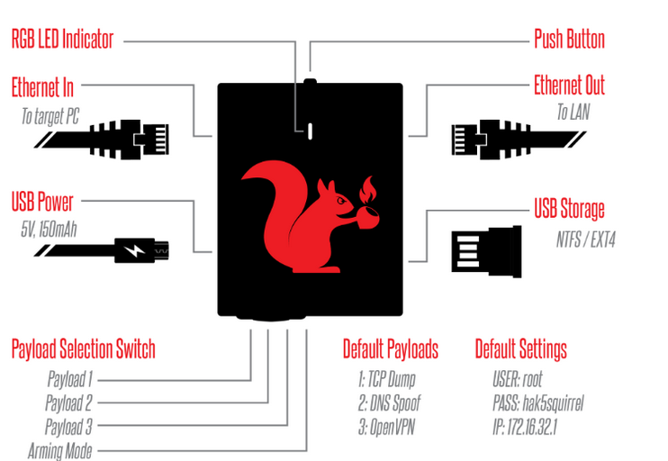
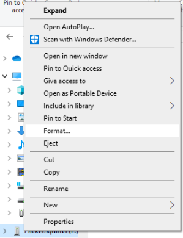
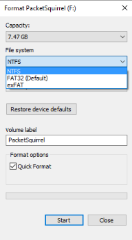
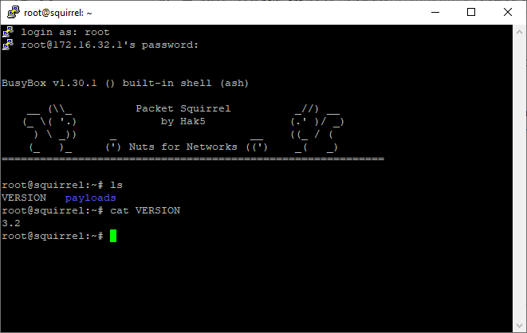
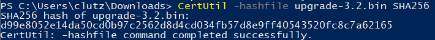

# Nifty Assignment - Packet Squirrel

## Background

The Packet Squirrel was released by Hak5 in 2017 as a pocket-sized, stealthy network tool. The Packet Squirrel has three default payloads: 1). Tcpdump; 2). IP Spoof; 3). Open VPN. The payload focused on through this assignment is the payload is switch 1, tcpdump. Tcpdump is a free software package and is a common packet analyzer. Tcpdump outputs pcap files of network traffic that are viewable in Wireshark. Wireshark is a free packet analyzer that is commonly used for network troubleshooting, analysis, development, and education; Wireshark can be used in a positive way to help solve network issues or maliciously such as in capturing usernames and passwords as they are sent across the network. This assignment utilizes the Packet Squirrel tcpdump payload to record network traffic and utilizes Wireshark to review the traffic recorded.    

## Meta Information

| Attribute | Description |
| --------- |-------------|
|Summary | Utilize the Packet Squirrel tcpdump payload to gather network traffic and Wireshark to analyze the network traffic and identify unencrypted username/passwords.     |
| Topics | Hak5, Packet Squirrel, Man in the middle, DNS Spoofing, tcpdump, Wireshark   |
|Audience |Students who are familiar with Wireshark and have interest in technology gadgets.  |
| Difficulty | This is designed to be a simple introduction to one function of the Packet Squirrel and the use of Wireshark through the tcpdump payload. Students who have never analyzed network traffic or utilized Wireshark may have a steep learning curve.   |
|Strengths | Introduction to a modern technological gadget that may be utilized with ethical intent by sysadmin as well as unethical by hackers.    |
| Weaknesses | It may be difficult to capture traffic through the Packet Squirrel on a machine connected to WiFi. Some machines may throw an error reporting an unsecure network.   |
| Dependencies Packet Squirrel, Reliable USB power source, short RJ45 connector(s), Access to network ports |
| Variants | There are two other default payloads on the Packet Squirrel (OpenVPN and IP Spoofing). Additionally, the focus may expand to other areas of network traffic analysis. |

### Additional Descriptions
|   |   |
|------------|----------|
|Assignment Description | This assignment is meant to be a hands-on example of using a popular technological tool in conjunction with a popular network analysis tool, Wireshark.   |
|Structure Description |The assignment is structured to guide the student through setting up the Packet Squirrel for traffic capture but remains open for more creativity and network analysis.  |
| How it Works Description | The tcpdump payload on the Packet Squirrel collects network traffic and saves it in a pcap file to be analyzed in Wireshark.    |

## Device Information

	The Packet Squirrel is a small black square with four different ports, a switch, LED, and a button on the top. The Packet Squirrel has by default three payloads and an arming mode which are accessible via the switch on the bottom of the device. This assignment focuses on utilizing the Packet Squirrel with payload 1, tcpdump, to capture network traffic and attempt to gather unencrypted username/password combinations. The image below, created by Taz Bedevilled for Hak5, shows a diagram of the packet Squirrel with each port and switch position labeled.

## Getting Started

### Download Wireshark
1.	Navigate to the Wireshark website at www.wireshark.org
2.	Click the left circle, ‘Download’ icon.
  * 
3.	Click the appropriate installer for your machine and follow the on-screen prompts.

### Format Flash Drive
By default, most flash drives are formatted in FAT/FAT32. The Packet Squirrel utilizes NTFS or EXT4; as such, the flash drive used in conjunction with the Packet Squirrel will need to be reformatted by following the below directions:
1.	Plug flash drive into PC.
2.	From directory, right click on flash drive and select “Format.”
  * 

3.	Select NTFS or EXT4 as the file system type.
  * 
4.	Check “Quick Format” and press Start. The flash drive will be ready for use with the Packet Squirrel following format.

### Connect to Packet Squirrel (Optional)
While there is no implicit need to SSH to the Packet Squirrel for this assignment other than verifying the firmware version, it is still helpful to know in utilizing either of the remaining payloads not covered through the course of this assignment.
1.	With the Packet Squirrel in switch position 4, Arming Mode, plug the packet squirrel into the PC via RJ45 connector. The RJ45 should be connected to the Packet Squirrel on the side of the USB Power.
2.	Open PuTTY, or another terminal emulator.  
3.	The IP of the Packet Squirrel is ‘172.16.32.1.’
4.	Login as ‘root.’
5.	The default password is ‘hak5squirrel.’

### Verify Firmware Version (Optional)
1.	SSH into the Packet Squirrel.
2.	Use the command ‘cat VERSION’ to display the firmware version number.
  * 

### Upgrade firmware (Optional)
Before getting started, it is good practice to ensure that the hardware utilized is operating on the latest firmware for security and efficiency. To upgrade and verify firmware on the Packet Squirrel, follow the directions below:
1.	Start by downloading the latest firmware from the Hak5 Download page at https://downloads.hak5.org/squirrel.
  * 
2.  Verify the download checksum for file integrity.
3.	Copy the downloaded file to the root of the flash drive previously formatted. Do not rename or alter the file.
4.	Eject the flash drive and plug the flash drive into an unpowered Packet Squirrel. Switch the Packet Squirrel to switch position 4, Arming Mode, and plug the Packet Squirrel into a reliable power source.
5.	The upgrade should occur automatically. The LED indicator light should alternate between red and blue while the firmware flash is underway. The indicator light will change to flashing Blue when the upgrade is complete.
  * If the update does not occur and the Packet Squirrel is not the most recent try rebooting the Packet Squirrel a second time. If that does not remedy the error, try a different flash drive. Some older flash drives do not register correctly in the Packet Squirrel.

### Verify Checksum (Optional)
Checking the hash file of downloads is important to ensure that the file downloaded is the same as an untampered file as intended by developers and has not been corrupted. If a file has been altered by a third party the hash value will be different from the value provided by the developer. Verifying a hash value may be considered a weak form of data integrity as verification does not verify the file origin. None the less, verifying hash values where available is good practice. The way outlined is merely one of many ways in which checksum may be verified:
1.	Open Command Prompt.
2.	Navigate to where the file is downloaded.
3.	Run the command, “CertUtil -hashfile upgrade-3.2.bin SHA256.”
  * 
4.	Compare the hash of the downloaded file against the hash supplied by the developer.
  * 
5.	In this case, the downloaded and anticipated checksums match.

## Assignment
Wireshark is a common network analysis tool utilized by system administrators and hackers alike. Within the past few years, there has been a large push for requiring websites to conduct business through encrypted communications using https. Even still, there are websites that utilize http. This assignment is a practicum in utilizing Wireshark after using a technology gadget, the Packet Squirrel, through tcpdump on a network.
1.	Plug a correctly formatted flash drive into an unplugged Packet Squirrel.
2.	Insert the Packet Squirrel between a network you want to capture by connecting the network into the ‘Ethernet out’ port above the flash drive and the device to be captured connected via the ‘Ethernet in’ port on the Packet Squirrel.
3.	Ensure the Packet Squirrel is in switch position 1, closest to the USB Power, and connect the Packet Squirrel to a reliable power source.
  * When booting, the Packet Squirrel LED will flash Green.
  * Once booted and the attack is ongoing, the default LED color is Amber/Yellow.
4.	Visit websites, login to websites, and otherwise simulate network traffic.
5.	When complete, press the button on the top of the Packet Squirrel to conclude the capture. The LED will flash Red once to signal complete then go dark.
6.	Remove the Packet Squirrel and reconnect the network as it was prior to placing the Packet Squirrel in-between.
7.	Unplug the USB from the Packet Squirrel and plug the USB into a device with Wireshark downloaded. On the drive are nested folders: /loot/tcpdump/…
  * Open the capture file in Wireshark and analyze the documented traffic.
8.	To filter, select the display filter bar at the top of the screen, examples below:  
  * To clean up the display and filter out the Address Resolution Protocol network traffic, type “not arp” into the display filter.
  * To specify http traffic, type “http” into the display filter.
  * To specify http traffic login info captured, type “http.request.method=="POST"”
9.	Analyze the tcpdump through Wireshark and identify different secure and, if applicable, unsecure login attempts.

## Model Grading Criteria
Upon successful completion of this assignment the student should have successfully utilized the Packet Squirrel to capture network traffic utilizing the tcpdump payload. The student should have analyzed and identified both encrypted and un-encrypted, as applicable, login attempts made while the payload was running.
